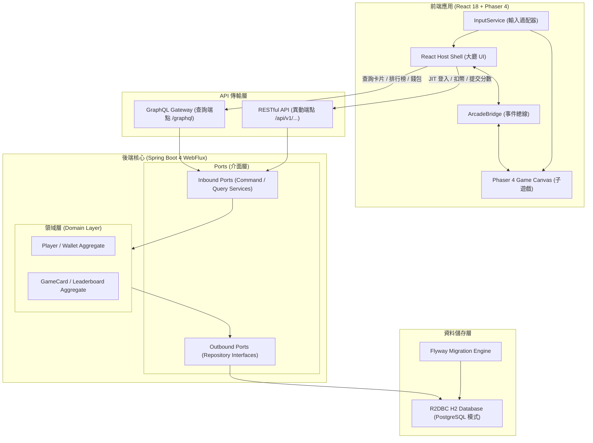

# 🕹️ Arcade Stadium 大型電玩合輯平台

<p align="center">
  
  
  
  
  
  
  
  
</p>

---

## 📖 平台簡介 (Introduction & Product Vision)

**Arcade Stadium** 是一個基於現代 Web 技術打造的模組化、極致沉浸式 HTML5 大型電玩合輯平台。平台結合響應式街機大廳、熱插拔遊戲引擎、六角架構（Hexagonal Architecture）後端與 CQRS 讀寫分離設計，致力於在瀏覽器中重現經典街機娛樂的純粹體驗。

平台採用全非同步反應式技術棧（Spring WebFlux + R2DBC + GraphQL），前端以 React 18 宿主外殼結合 Phaser 4 遊戲畫布，透過標準化事件總線 `ArcadeBridge` 與統一輸入轉換服務 `InputService`，達成前端大廳與各款獨立子遊戲之間的完全解耦。

---

## ✨ 核心特色 (Core Features)

### 1. 🛡️ GCP IAP 託管無縫身份認證 (GCP Identity-Aware Proxy)
- **免自刻登入頁面**：登入與 OAuth 流程完全由 Google Cloud Identity-Aware Proxy (IAP) 託管。
- **JIT 帳號自動佈署**：後端自 `X-Goog-Authenticated-User-Email` 標頭提取玩家 Email，在初次登入時自動以 UUID v4 佈署玩家檔案與錢包。

### 2. 🪙 統一錢包與單局扣幣機制 (Universal Wallet & Coin Deduction)
- **每日免費代幣 (Daily Free Quota)**：玩家每日登入可獲得 **10 枚免費代幣**。每日 00:00 自動惰性重置，不可跨日累積。
- **管理員獎勵代幣 (Admin Bonus Credits)**：管理員可手動發放獎勵代幣，永久有效且不受每日重置影響。
- **單局即投即玩**：點擊「START (1 Coin)」直接自錢包扣除 1 枚代幣啟動遊戲，支援樂觀鎖（Optimistic Locking）防併發超扣，中途離場不留殘幣。

### 3. 🎮 跨裝置控制系統 (Multi-Device InputService)
- **鍵盤控制**：`WASD` / 方向鍵移動，`Space`/`Enter`/`J`/`Z` 動作按鈕，`C` 鍵投幣，`ESC`/`P` 暫停。
- **實體手把 / 街機搖桿**：透過 W3C Gamepad API 自動辨識 USB 與藍牙控制器（如 Xbox、PlayStation、街機大搖台）。
- **行動裝置虛擬按鈕**：於手機/平板裝置自動渲染虛擬十字鍵 (D-Pad) 與動作觸控鈕。

### 4. ⚡ 解耦遊戲橋接架構 (ArcadeBridge & Lifecycle)
- **標準化生命週期**：透過 `IArcadeGame` 介面規範 `init()`, `start()`, `pause()`, `resume()`, `destroyGame()`。
- **零記憶體洩漏**：離開遊戲回到大廳時，自動銷毀 Canvas 並完整釋放 WebGL Texture 與 WebAudio 音訊快取。

### 5. 🏆 獨立前十名排行榜 (Per-Game Top 10 Leaderboards)
- **遊戲獨立記分**：每款子遊戲（`game_id`）具備專屬歷史 Top 10 榜單。
- **同分排序仲裁**：同分時依照玩家 Email 字母順序（A-Z ASC）排序。

### 6. 📺 復古沉浸視覺與音效 (CRT Shader & Global Sound Engine)
- **CRT 濾鏡**：內建復古陰極射線管（CRT）掃描線 Shader 濾鏡，支援大廳自由開啟/關閉。
- **全域 WebAudio 音效引擎**：支援 Master Volume 滑桿調音、全域一鍵靜音與失焦自動靜音保護。

---

## 🕹️ 收錄遊戲合輯 (Game Catalog)

| 遊戲名稱 | 類型 | 核心玩法與規格特色 |
| :--- | :--- | :--- |
| **俄羅斯方塊<br>(Tetris Classic)** | 益智方塊 | • 嚴格遵循 SRS (Super Rotation System) 旋轉與 5 點 Wall Kick 判定<br>• 7-Bag 公平發牌袋演算法<br>• 具備 NEXT 預覽、Hold 暫存區與 Ghost 影子方塊（支援經典/現代模式）<br>• Level 1~15 平緩加速下落曲線與 Hard/Soft Drop 即時計分 |
| **小精靈<br>(Pac-Man Classic)** | 迷宮動作 | • 經典 28×36 Tile 迷宮網格與轉向輸入緩衝 (Direction Buffer)<br>• 4 隻個性化幽靈 AI（Blinky 直追、Pinky 伏擊、Inky 雙倍向量包抄、Clyde 游移）<br>• Scatter / Chase 定時循環狀態機<br>• 能量豆（Power Pellet）驚恐反吞模式與連續吃鬼倍數計分（200→400→800→1600）<br>• 兩階段水果獎勵生成（櫻桃至鑰匙） |
| **水管工人<br>(Pipe Mania Classic)** | 路徑規劃 | • 10×7 網格與鍵盤/搖桿游標操作，13 種水管元件（標準、單向、水庫緩衝、十字交叉）<br>• 5 格 FIFO 發牌佇列，支援水流前覆蓋替換扣分機制<br>• 0%~100% 平滑連續水流推進遮罩動畫<br>• BFS/DFS 地圖 100% 保證可解性自動驗收與開口防死路約束<br>• 3 支扳手生命制、50,000 分獎勵加命與 Fast Forward 手動加速雙倍計分 |
| **台灣16張麻將<br>(Taiwanese Mahjong)** | 棋牌競技 | • 完整 144 張牌庫、多輪自動補花流程與牌牆理牌動畫<br>• 16 張（5 面子 + 1 眼，$17+K$ 張）法定胡牌驗證，杜絕詐胡<br>• 支援嚦咕嚦咕（八對半）、八仙過海、七搶一等經典特殊大役<br>• 吃、碰、大明槓/暗槓/加槓、聽牌與過水防呆動作選單<br>• 500 底 / 200 台台數互斥結算引擎與向聽數（Shanten）防守 AI 電腦對手<br>• 標準四圈一將流轉、東南西北抓位擲骰與連莊拉莊計分 |

---

## 🏗️ 系統架構 (System Architecture)

本專案採用 **CQRS (Command Query Responsibility Segregation)** 讀寫分離模式與 **六角架構 (Hexagonal Architecture)**：



### 讀寫分離與架構分工
- **Query（查詢端）**：由 **GraphQL Gateway (`/graphql`)** 統一處理，支援多層級關聯查詢（如查詢 Player 時連帶載入 Wallet），提升大廳資料加載效能。
- **Command（異動端）**：由 **RESTful API (`/api/v1/...`)** 提供標準化異動端點，負責身分驗證、代幣扣除（支援樂觀鎖版本控制與 409 Conflict 重試）、管理員發幣與高分紀錄上傳。

---

## 📁 目錄結構 (Directory Structure)

```text
arcade/
├── docs/                                  # 規格與架構設計文件
│   ├── 01-requirements/                   # 需求規格與 PRD
│   │   ├── PRD/                           # 各模組 PRD (平台、Tetris、Pacman、PipeMania、Mahjong)
│   │   ├── user-stories/                  # 使用者故事 (US-01 ~ US-05)
│   │   └── glossary.md                    # 領域術語表 (Domain Glossary)
│   └── 02-design-specs/                   # 設計規範與契約
│       ├── api-contracts/                 # OpenAPI 3.2 契約規格 (openapi.yaml)
│       ├── behavior-specs/                # BDD Gherkin 特徵檔 (Cucumber/Behave)
│       ├── db-schemas/                    # DBML 物理資料庫綱要 (schema.dbml)
│       ├── external-integrations/         # Hexagonal 服務 Manifest
│       ├── ui-schemas/                    # UI Manifest 配置
│       └── uml/                           # PlantUML 領域模型、契約與循序圖
├── engineers/03-implementations/          # 程式碼實作
│   ├── backend/                           # Reactive 後端服務 (Spring Boot 4 + WebFlux + R2DBC)
│   │   ├── src/main/java/com/arcade/stadium/
│   │   │   ├── adapter/in/web/            # REST Controller & GraphQL Resolvers
│   │   │   ├── adapter/out/persistence/   # R2DBC Repositories & Entity Configurations
│   │   │   ├── application/port/          # Inbound / Outbound Ports
│   │   │   ├── application/service/       # Application Services (Use Cases)
│   │   │   └── domain/                    # Entities, Value Objects, DTOs & Exceptions
│   │   ├── src/main/resources/
│   │   │   ├── db/migration/              # Flyway 資料庫遷移檔 (V1 ~ V4)
│   │   │   ├── graphql/schema.graphqls    # GraphQL Schema 定義
│   │   │   └── application.yml            # 應用程式設定檔
│   │   └── pom.xml
│   ├── frontend/                          # 前端大廳與遊戲實作 (React 18 + Phaser 4 + TS)
│   │   ├── src/
│   │   │   ├── core/                      # 核心模組 (ArcadeBridge, InputService, SoundEngine)
│   │   │   ├── games/                     # 子遊戲實作 (tetris, pacman, pipemania, mahjong)
│   │   │   ├── hooks/                     # TanStack Query 資料查詢 Hooks
│   │   │   ├── json-render/               # SDD UI 組件與大廳渲染器
│   │   │   └── pages/                     # 大廳頁面與入口
│   │   ├── package.json
│   │   └── vite.config.ts
│   └── devops/                            # 部署與容器化設定
│       └── Dockerfile                     # Eclipse Temurin 25 JRE Alpine 輕量映象檔
├── LICENSE                                # Apache 2.0 開源許可證
└── README.md                              # 專案說明文件
```

---

## 🚀 快速開始 (Quick Start Guide)

### 環境需求 (Prerequisites)
- **Java**: OpenJDK 25 或更高版本
- **Maven**: 3.9+
- **Node.js**: 20.x+ 與 **npm** / **pnpm**
- **Docker** (選用，用於容器化執行)

---

### 1. 後端啟動 (Backend Setup)

```bash
cd engineers/03-implementations/backend

# 編譯並執行單元與整合測試
mvn clean test

# 啟動後端 WebFlux 服務 (預設埠號 8080)
mvn spring-boot:run
```

- **API 服務位址**：`http://localhost:8080`
- **GraphiQL 互動式查詢介面**：`http://localhost:8080/graphiql`

---

### 2. 前端啟動 (Frontend Setup)

```bash
cd engineers/03-implementations/frontend

# 安裝相依套件
npm install

# 啟動 Vite 開發伺服器
npm run dev
```

- **前端大廳位址**：`http://localhost:5173`

---

### 3. 一鍵建置與 Docker 容器化執行 (Docker Deployment)

專案支援將前端打包靜態資產整合入 Spring Boot 後端 Jar，並以最小化 Alpine JRE 容器運行：

```bash
# 1. 前端編譯產出至 dist
cd engineers/03-implementations/frontend
npm run build

# 2. 後端打包 Jar (含靜態資源)
cd ../backend
mvn clean package -DskipTests

# 3. 複製 Jar 並建置 Docker 映象檔
cd ../devops
cp ../backend/target/arcade-backend-1.0.0-SNAPSHOT.jar ./app.jar
docker build -t arcade-stadium:latest .

# 4. 啟動容器
docker run -d -p 8080:8080 --name arcade-app arcade-stadium:latest
```

存取 `http://localhost:8080` 即可直接進入 Arcade Stadium 遊戲大廳。

---

## 🔌 API 與 GraphQL 介面 (API Reference)

### 1. RESTful Mutation 端點 (`/api/v1`)

| 方法 | 路徑 | 說明 | 關鍵標頭 / 參數 |
| :--- | :--- | :--- | :--- |
| `POST` | `/players:whoami` | GCP IAP 身份驗證、自動建立玩家檔案與每日代幣惰性重置 | Header: `X-Goog-Authenticated-User-Email` |
| `POST` | `/user-wallets/{id}/deduct-credit` | 扣除 1 枚代幣啟動遊戲（支援樂觀鎖防並發） | `version`: 樂觀鎖版本號 |
| `POST` | `/user-wallets/{id}/grant-admin-credit` | 管理員手動派發額外代幣（永久有效） | `creditAmount`: 發放數量 |
| `POST` | `/leaderboard-entries` | 提交單局結算高分紀錄 | `gameCardId`, `playerEmail`, `score` |

### 2. GraphQL Gateway 查詢端點 (`/graphql`)

```graphql
# 查詢所有遊戲卡片與專屬 Top 10 排行榜
query GetLobbyCatalog {
  listGameCards {
    id
    gameId
    title
    coverArtUrl
    description
    totalPlayCount
  }
  tetrisTop10: getTop10Leaderboard(gameId: "tetris") {
    playerEmail
    score
    submittedAt
  }
}

# 查詢玩家帳號與錢包代幣餘額
query GetPlayerWallet($playerId: ID!) {
  getPlayerById(id: $playerId) {
    id
    gcpIapEmail
    isAdmin
    wallet {
      dailyFreeCredit
      adminBonusCredit
      totalCredits
    }
  }
}
```

---

## 🧪 測試與品質驗證 (Testing & Quality Assurance)

本專案採嚴格的測試驅動與行為規範驗證：

```bash
# 執行前端單元與組件測試 (含覆蓋率報告)
cd engineers/03-implementations/frontend
npm run test:coverage

# 執行後端反應式單元測試、整合測試與 Jacoco 覆蓋率檢查
cd engineers/03-implementations/backend
mvn verify
```

- **BDD Gherkin 規格**：收錄於 `docs/02-design-specs/behavior-specs/`，涵蓋錢包扣幣、防呆胡牌、小精靈 AI 等行為驗證。
- **測試工具鏈**：Vitest、React Testing Library、Mock Service Worker (MSW)、Spring Reactor Test (`StepVerifier`)、Spring GraphQL Tester、Jacoco。

---

## 📜 許可證 (License)

本專案依據 **[Apache License 2.0](LICENSE)** 條款開源發布。
